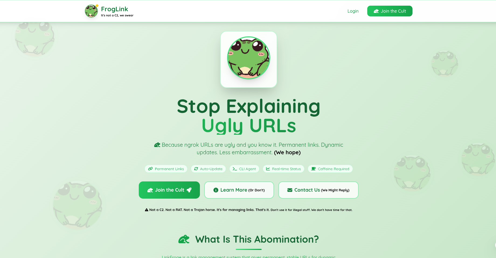
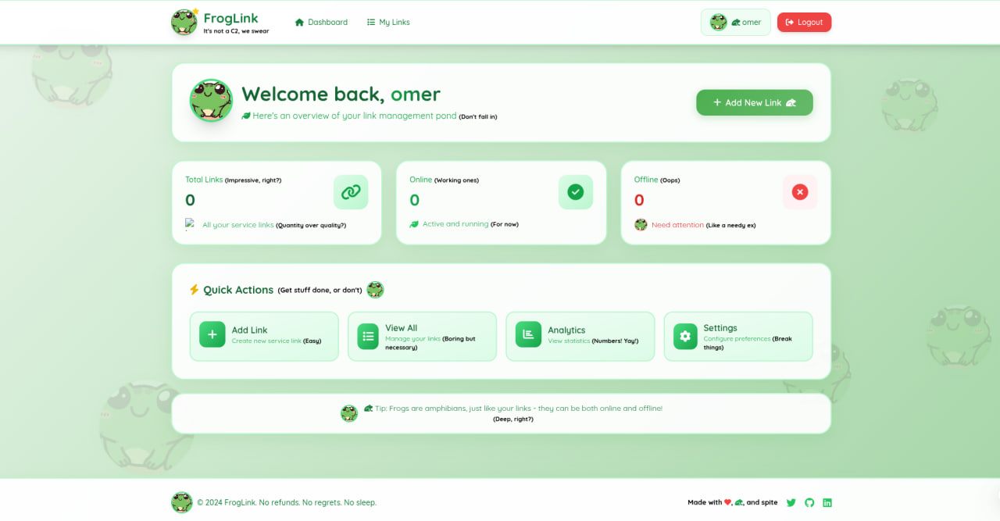
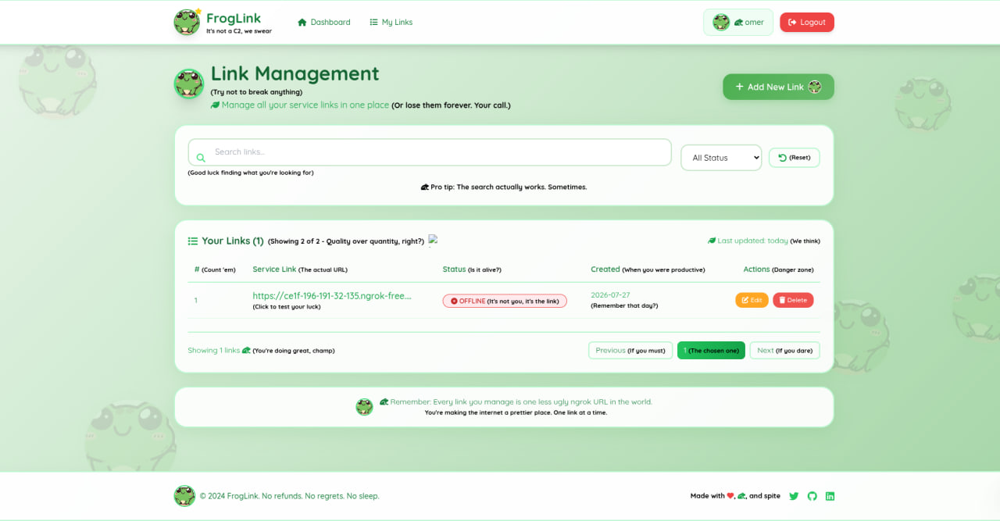
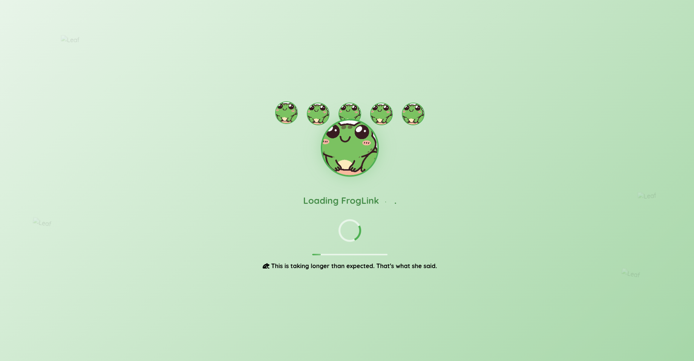

# FrogLink

<p align="center">
  
</p>

---

## Because ngrok URLs are ugly and you know it.

FrogLink is a link management system that gives permanent, stable URLs for dynamic services like ngrok tunnels, local development servers, and other temporary endpoints.

**Basically:** You get a pretty link. It points to your ugly ngrok URL. When ngrok changes, you update it. No one notices. Magic. You're welcome.

---

## It is capable of

- **Permanent Links** – Generate stable URLs that don't change. Revolutionary, I know.
- **CLI Agent** – Auto-starts ngrok, detects URL changes, sends heartbeats. Like a digital heartbeat. Creepy.
- **Web Dashboard** – User-friendly link management with statistics. Because numbers make you feel important.
- **REST API** – Full CRUD operations with token authentication. For the nerds.
- **Community Links** – Share your links with the world (or don't, we're not your mom)
- **Comments** – Because everyone has an opinion. And now they can share it. (Placeholder for now, but it's there)
- **Category System** – Organize your links. Or don't. Chaos is also an option.
- **Public/Private Visibility** – Share with everyone or keep it to yourself. Your secret is safe with us.
- **Sarcasm Engine** – Because every good tool needs personality. And we have plenty.
- **Active Link Highlighting** – Know where you are. Or don't. We'll show you anyway.
- **Link Status Checking** – See if a link is online or offline. (We check. Sometimes it works.)
- **User Attribution** – See who shared what. (Probably a bot. Or not. Who knows?)
- **Responsive Design** – Works on desktop, tablet, and mobile. Because you're always on something.
- **Category Filtering** – Filter links by category. Because finding what you want is overrated.

---

## Showcase

<div align="center">

### Home Page


*"Wow, this looks professional" – Someone who hasn't seen the code yet*

<br><br>

### Dashboard


*Numbers Graphs Stuff You're basically a data analyst now*

<br><br>

### Link Management


*Create. Edit. Delete. Cry. The cycle of life.*

<br><br>

### Community Links


*Share with the world. Or don't. We're not your mom.*

<br><br>

### Comment Section


*"First" – Every comment section ever.*

<br><br>

### Loading Animation


*Because waiting is fun. Especially with frogs.*

</div>

---

## The Fine Print (Read It Or Don't, I'm Not Your Mom)

This is a **legitimate tool**. Not a C2. Not a RAT. Not a Trojan horse. I swear. Mostly.

It's for managing links. That's it. Don't use it for illegal stuff. I don't have time for that. I have coffee to drink and code to break.

---

## What It Does (When It's Not Crashing)

### Core Features
- **Permanent Links** – Generate stable URLs that don't change. Revolutionary, I know.
- **CLI Agent** – Auto-starts ngrok, detects URL changes, sends heartbeats. Like a digital heartbeat. Creepy.
- **Web Dashboard** – User-friendly link management with statistics. Because numbers make you feel important.
- **REST API** – Full CRUD operations with token authentication. For the nerds.

### Community Features
- **Public Links** – Share your links with the community. Because sharing is caring.
- **Comments Section** – Collapsible comments on every public link. (Placeholder – comments stay in your browser until we add backend)
- **Category Filtering** – Filter links by category. Because finding what you want is overrated.
- **Link Status** – See if a link is online or offline. (We check. Sometimes it works.)
- **User Attribution** – See who shared what. (Probably a bot. Or not. Who knows?)

### UI/UX Features
- **Active Link Highlighting** – Green active states on all navigation links. So you know where you are.
- **Responsive Design** – Works on desktop, tablet, and mobile. Because you're always on something.
- **Sarcasm Integration** – Because every good tool needs personality.
- **Loading Screen** – With frogs. Because why not.

---

## How It Works (Try To Keep Up)

1. CLI agent starts ngrok and monitors URL
2. URL changes detected -> backend updated automatically
3. Your permanent link always points to the right place
4. Users never see the ugly URL
5. Optional: Share links publicly with the community
6. People can comment on your links (when we add the backend)
7. Filter links by category. Or don't. We're not your mom.

**It's like magic. But with more code. And less rabbits.**

---

## Quick Start (Without Breaking Things)

### 1. Clone the Repository
```bash
git clone https://github.com/yourusername/linkfroge.git
cd linkfroge
```

### 2. Create Virtual Environment
```bash
python3 -m venv .venv
source .venv/bin/activate  # On Windows: .venv\Scripts\activate
```

### 3. Install Dependencies
```bash
pip install -r requirements.txt
```

### 4. Configure Environment
Create `.env` file:

```env
SECRET_KEY=your-secret-key-here
DEBUG=True
BASE_URL=http://localhost:5000
DATABASE_URL=sqlite:///linkfroge.db

# SMTP Configuration (for email features)
SMTP_LINK=smtp.gmail.com
SMTP_PORT=587
EMAIL=your-email@gmail.com
EMAIL_PASSWORD=your-app-password
```

### 5. Initialize Database
```bash
cd webApp
python -c "from app import app, db; app.app_context().push(); db.create_all()"
```

### 6. Run Web Application
```bash
python app.py
```
Open `http://localhost:5000` in your browser.

### 7. Run CLI Agent (Optional)
```bash
cd desktop_app
python linkFroge.py --port 5000 --backend https://yourdomain.com/api/service/update --service-id YOUR_ID --token YOUR_TOKEN
```

### 8. Create Your First Link
1. Register an account
2. Log in
3. Go to "My Links"
4. Click "Add New Link"
5. Fill in the details
6. Choose visibility (Public/Private)
7. Select a category
8. Click "Add Link"

**Congratulations! You're now a link management expert. Probably.**

---

## CLI Options (For The Brave)

| Option | What It Does | Default |
|--------|--------------|---------|
| `--port` | Local port to expose | 5000 |
| `--backend` | Backend API URL | https://yourdomain.com/api/service/update |
| `--service-id` | Unique service identifier | abc123 |
| `--token` | Authentication token | your_secure_token |
| `--verbose` | Enable verbose logging | False |

**Pro tip:** Don't lose your token. I'm not making you another one.

---

## API Endpoints (For The Nerds)

| Method | Endpoint | Description | Auth Required |
|--------|----------|-------------|---------------|
| GET | `/api/links` | Get all your links | Yes (Token) |
| POST | `/api/links` | Create a new link | Yes (Token) |
| PUT | `/api/links/{slug}` | Update a link | Yes (Token) |
| DELETE | `/api/links/{slug}` | Delete a link | Yes (Token) |
| GET | `/api/links/{slug}/stats` | Get link statistics | Yes (Token) |
| GET | `/{slug}` | Redirect to original URL | No |
| GET | `/public_links` | View public links | No |
| GET | `/is_the_like_alive` | Check link status | No |

---

## Tech Stack (The Things That Make It Work)

- **Backend:** Flask, SQLAlchemy – because reinventing the wheel is for amateurs
- **Frontend:** TailwindCSS, Font Awesome – because looking good matters
- **Database:** SQLite (configurable for PostgreSQL) – where data goes to sleep
- **CLI:** Python, ngrok – the magic behind the curtain
- **Email:** SMTP with HTML templates – because notifications matter

---

## Project Structure (The Mess)

```
LinkFroge/
├── desktop_app/                # CLI agent
│   ├── linkFroge.py            # The main event
│   └── phishing/               # (Don't ask. Seriously.)
│
├── webApp/                     # Flask web app
│   ├── app.py                  # Start here
│   ├── api/                    # REST API (the talking part)
│   ├── database/               # Models & DB (where data sleeps)
│   ├── utility/                # Helpers (the helpful bits)
│   │   ├── email_temp.py       # Email templates (fancy)
│   │   ├── setting.py          # Config (the boring but important part)
│   │   ├── token_auth.py       # Token auth (the guard dog)
│   │   └── link_manager.py     # Link logic (the brain)
│   ├── view/                   # Routes (the actual bits)
│   └── templates/              # HTML files (the pretty bits)
│
├── templates/                  # More HTML files (we like options)
├── screen_shot/                # Screenshots (you're looking at them)
├── requirements.txt            # Things you need
├── .env.example                # Copy this. Don't skip it.
└── README.md                   # You're reading this
```

---

## Features Roadmap (The Future)

- [x] Public/Private Links – Share with the world or keep it secret
- [x] Category System – Organize your links
- [x] Community Links Page – See what others are sharing
- [x] Comments Section – Discuss links with the community (frontend placeholder)
- [x] Sarcastic UI – Because serious tools are boring
- [x] Active Link Highlighting – Know where you are
- [ ] User Ratings – Rate links (coming soon)
- [ ] Comment Backend – Persistent comments (coming soon)
- [ ] API Rate Limiting – Because too many requests are annoying
- [ ] Dark Mode – For the night owls
- [ ] Link Analytics – See who clicked what (creepy, but useful)
- [ ] Multiple ngrok Support – More tunnels, more problems
- [ ] Docker Support – Containerize all the things

---

## Contributing (Because We Need Help)

Contributions are welcome! Here's how:

1. Fork the repository
2. Create a feature branch: `git checkout -b feature-awesome`
3. Make your changes
4. Test thoroughly (we're not your QA team)
5. Submit a pull request
6. Wait for approval (or rejection)
7. Cry if rejected. Celebrate if accepted.

**Rules:**
- Don't break things. Or do. I'm not your mom.
- Add sarcasm. It's required.
- Comment your code. Future you will thank you.
- Be a decent human. It's not that hard.

---

## License

This project is licensed under the MIT License – see the [LICENSE](LICENSE) file for details.

**Basically:** Do whatever you want. Just don't blame us if it breaks.

---

## Acknowledgments

- **Flask** – For not being Django
- **SQLAlchemy** – For making databases less painful
- **TailwindCSS** – For making things look good with minimal effort
- **Font Awesome** – For the pretty icons
- **ngrok** – For existing
- **Coffee** – For existing
- **Sarcasm** – For making this all possible

---

## Contact

- **GitHub Issues:** [Report a bug](https://github.com/yourusername/linkfroge/issues)
- **Email:** your.email@example.com
- **Twitter:** @yourhandle

---

<p align="center">
  
  <br>
  <sub>Built with spite. Powered by sarcasm. Sustained by coffee.</sub>
  <br>
  <sub>No refunds. No regrets. No sleep.</sub>
  <br>
  <sub>Go outside. Touch grass. Or don't. I'm not your mom.</sub>
  <br><br>
  <sub>FrogLink – Because ngrok URLs are ugly and you know it.</sub>
</p>